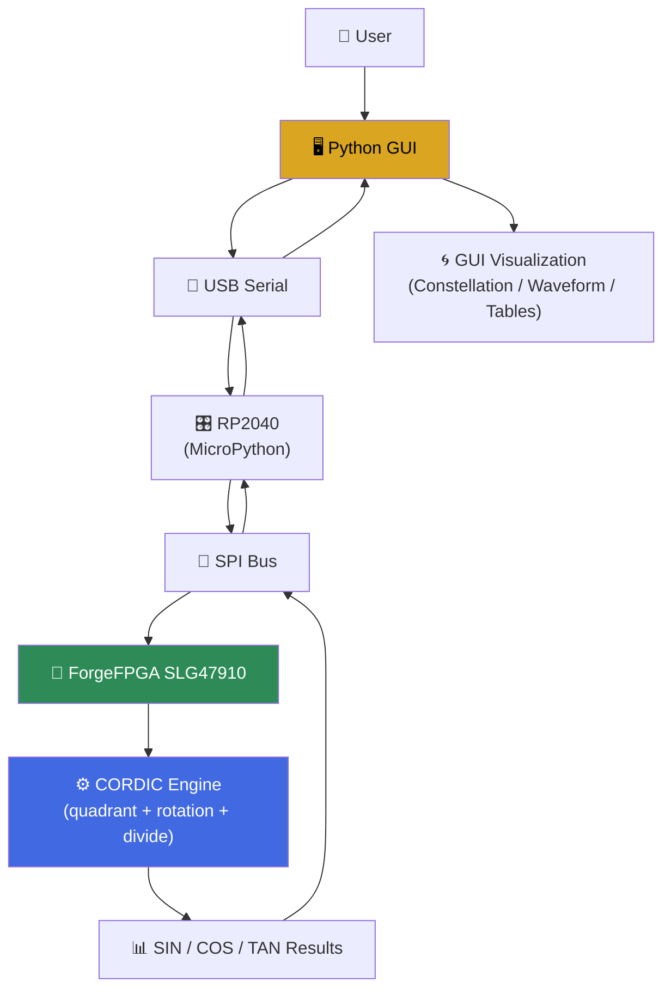
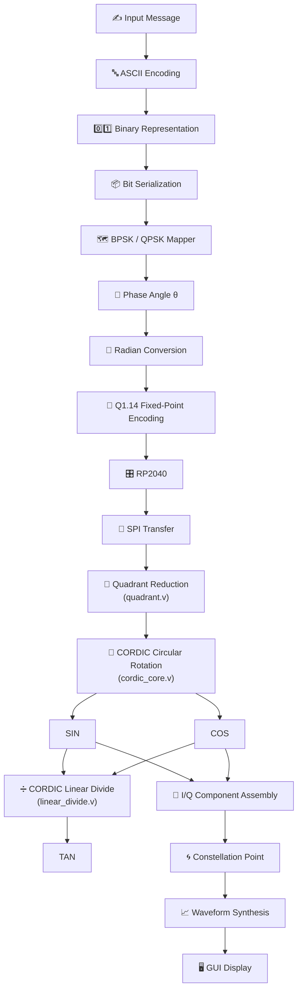
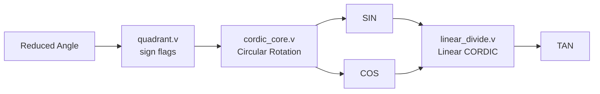
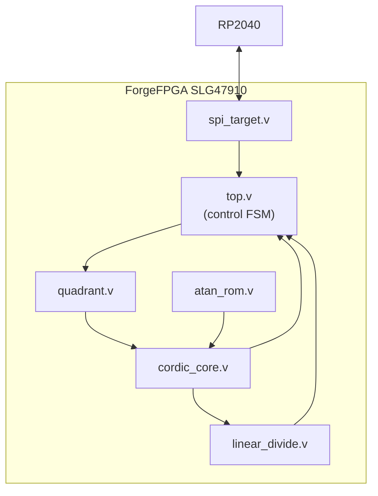

<div align="center">

# 📡 FPGA-Based CORDIC Digital Communication Demonstrator

### Real Hardware SIN / COS / TAN Computation Driving BPSK & QPSK Modulation

**A complete, hardware-verified digital communication chain — not a simulation, not a calculator.**

*Built on the Vicharak Shrike Lite (ForgeFPGA SLG47910 + RP2040)*

<br/>

[](https://www.python.org/)
[](https://en.wikipedia.org/wiki/Verilog)
[](https://www.renesas.com/)
[](https://en.wikipedia.org/wiki/Serial_Peripheral_Interface)
[](https://en.wikipedia.org/wiki/CORDIC)
[](#)
[](#-bpsk-binary-phase-shift-keying)
[](#-qpsk-quadrature-phase-shift-keying)
[](#-license)
[](#-hardware-used)

</div>

---

> ⚠️ **This project performs REAL hardware computation.** Every SIN, COS, and TAN value used in this repository is computed inside the FPGA fabric using the CORDIC algorithm, expressed purely as shift-and-add operations. **Python never calls `math.sin()`, `math.cos()`, or `math.tan()` to produce a result** — those functions are used only, and exclusively, as a reference for validating what the FPGA computed. The Python GUI is a **visualization and control layer**, not a computation engine.

---

## 📖 Table of Contents

- [Project Overview](#-project-overview)
- [Key Features](#-key-features)
- [Hardware Used](#-hardware-used)
- [Software Stack](#-software-stack)
- [System Architecture](#-system-architecture)
- [Complete Processing Pipeline](#-complete-processing-pipeline)
- [The CORDIC Algorithm](#-the-cordic-algorithm)
- [TAN Computation](#-tan-computation)
- [FPGA Architecture](#-fpga-architecture)
- [GUI Features](#-gui-features)
- [Backend Processing Visualization](#-backend-processing-visualization)
- [BPSK (Binary Phase Shift Keying)](#-bpsk-binary-phase-shift-keying)
- [QPSK (Quadrature Phase Shift Keying)](#-qpsk-quadrature-phase-shift-keying)
- [SPI Communication Protocol](#-spi-communication-protocol)
- [GUI Screenshots](#-gui-screenshots)
- [Folder Structure](#-folder-structure)
- [Installation](#-installation)
- [Running the Project](#-running-the-project)
- [Results](#-results)
- [Future Enhancements](#-future-enhancements)
- [Acknowledgements](#-acknowledgements)
- [Author](#-author)

---

## 🎯 Project Overview

Digital communication systems — from Wi-Fi to satellite links to 5G — are built on a deceptively simple mathematical foundation: rotating a signal's phase to encode information, using nothing more than **sine and cosine**. Every phase-shift-keyed modulation scheme maps a bit or a group of bits onto a point on a circle, and that point is defined entirely by `(cos θ, sin θ)`.

Most educational projects teach this concept using `numpy.sin()` and `numpy.cos()` in a Jupyter notebook. This project deliberately does **not** do that. Instead, it asks and answers a harder, more interesting question:

> *What does it actually take to compute sine, cosine, and tangent using only addition, subtraction, and bit-shifts — on a real, resource-constrained FPGA — and then use those hardware-computed values to build a real modulator?*

The answer is the **CORDIC algorithm** (COordinate Rotation DIgital Computer), the same class of algorithm used inside real-world DSP chips, software-defined radios, and DDS (Direct Digital Synthesis) hardware, precisely because it avoids multipliers entirely. On a small FPGA like the SLG47910 — which has no dedicated multiplier blocks and a tight CLB budget — CORDIC isn't an academic curiosity, it's the *only* practical way to get trigonometric functions in hardware.

### Why FPGA implementation matters

A microcontroller computing `sin()` calls a library function that ultimately reduces to a polynomial or table approximation running on a general-purpose ALU, sequentially, at clock speeds bottlenecked by fetch-decode-execute overhead. An FPGA implementation, by contrast, is a **purpose-built circuit**: every clock cycle, the same small set of adders and shifters is doing exactly the useful work it was wired to do, with deterministic, cycle-accurate latency. This project exposes that difference directly — you can watch, cycle by cycle, the CORDIC vector converge.

### Why digital communications need SIN and COS

Every phase-shift-keying (PSK) scheme transmits information by placing a symbol at a specific phase angle `θ` on the unit circle. To actually generate or demodulate that waveform, a radio needs the **I/Q components** `(cos θ, sin θ)` of that angle. This project makes that dependency explicit and tangible: the same CORDIC core that answers "what is sin(37°)?" is the core that generates the BPSK and QPSK symbols later in the pipeline.

### Why this project is educational

This repository is designed to be read, not just run. It intentionally exposes:
- The exact fixed-point format used at every stage
- The exact number of CORDIC iterations and why that number was chosen
- The exact resource trade-offs made to fit inside a **140-CLB** FPGA
- A GUI that visualizes every intermediate value — not just the final constellation

If you are learning CORDIC, fixed-point arithmetic, SPI protocol design, or digital modulation, this project is meant to be a working reference you can step through end-to-end.

---

## ✨ Key Features

| Feature | Description | Status |
|---|---|:---:|
| 🧮 **FPGA CORDIC Core** | Real hardware sin/cos computation via shift-add rotation | ✔️ |
| 🔄 **Circular Rotation Mode** | Computes SIN and COS from an arbitrary reduced angle | ✔️ |
| ➗ **Linear Divide Mode** | Computes TAN = SIN / COS using a second, linear CORDIC | ✔️ |
| 📐 **Arbitrary Angle Support** | Any input angle (degrees or radians, any magnitude) reduces correctly | ✔️ |
| 📶 **BPSK Modulation** | Binary phase-shift keying driven by FPGA-computed phase | ✔️ |
| 📡 **QPSK Modulation** | Quadrature phase-shift keying with Gray-coded symbol mapping | ✔️ |
| 🖥️ **Interactive GUI** | Full desktop interface for control and visualization | ✔️ |
| 🔍 **Backend Processing Visualization** | Every pipeline stage (ASCII → bits → phase → CORDIC → I/Q) shown live | ✔️ |
| 🌀 **Constellation Diagram** | Live I/Q scatter plot of transmitted symbols | ✔️ |
| 📈 **Waveform Plotting** | Time-domain modulated waveform rendering | ✔️ |
| 🔌 **SPI Communication** | Custom lightweight command protocol (A1–A9) | ✔️ |
| 🎛️ **RP2040 Interface** | MicroPython bridge between GUI and FPGA | ✔️ |
| 🔧 **Real Hardware Demonstration** | No software trig fallback — FPGA-only computation | ✔️ |

---

## 🔧 Hardware Used

| Component | Role | Details |
|---|---|---|
| **Vicharak Shrike Lite** | Development board | Carrier board integrating the ForgeFPGA and RP2040 on a single PCB |
| **ForgeFPGA SLG47910** | Main compute fabric | Renesas/Dialog ultra-low-power CPLD/FPGA hybrid; **140 CLBs total**, no hardware multiplier — the entire CORDIC pipeline had to be hand-optimized to fit this budget |
| **RP2040** | Host microcontroller | Runs MicroPython; acts as SPI controller, bridges USB-serial commands from the GUI to SPI transactions on the FPGA |
| **USB-Serial Link** | GUI ↔ RP2040 transport | Standard USB CDC serial connection; carries commands and results between the Python GUI and the RP2040 |
| **SPI Bus (RP2040 ↔ FPGA)** | On-board interconnect | 4-wire SPI, RP2040 as controller / FPGA as target, custom byte-level command protocol |

---

## 💻 Software Stack

| Layer | Technology | Purpose |
|---|---|---|
| **Hardware Description** | Verilog | All FPGA logic — CORDIC cores, control FSM, SPI target |
| **Microcontroller Firmware** | MicroPython | Runs on the RP2040; handles SPI transactions and USB-serial bridging |
| **Flashing / Dev Environment** | Thonny | Used to flash MicroPython firmware and the FPGA bitstream to the RP2040/Shrike Lite |
| **GUI Application** | Python 3 | Main desktop application logic |
| **GUI Framework** | PyQt | Widgets, pages, live-updating dashboard |
| **Plotting** | Matplotlib | Constellation diagrams, waveform plots, iteration convergence plots |
| **Numerical Reference** | NumPy / `math` | Used **only** to compute expected values for validation display — never fed into the transmitted signal |

---

## 🏗️ System Architecture



**Every arrow pointing into the FPGA carries a command; every arrow pointing out carries a hardware-computed result.** No trigonometric computation happens anywhere except inside block `G`.

---

## 🔄 Complete Processing Pipeline

The full journey of a single transmitted message, from keyboard to constellation point:



Every box from `Quadrant Reduction` through `TAN` executes **entirely inside the FPGA fabric**. Nothing above the `RP2040` box or below the `I/Q Component Assembly` box touches hardware trigonometry.

---

## 🧮 The CORDIC Algorithm

CORDIC computes rotations of a 2D vector using only **shifts and additions**, entirely avoiding multipliers — which is precisely why it was chosen for the SLG47910, a device with **no dedicated multiplier hardware**.

### Circular Rotation Mode

Starting from a vector `(x₀, y₀) = (K, 0)` and a target angle `z₀`, each iteration `i` applies:

```
if zᵢ ≥ 0:
    xᵢ₊₁ = xᵢ − (yᵢ >> i)
    yᵢ₊₁ = yᵢ + (xᵢ >> i)
    zᵢ₊₁ = zᵢ − atan(2⁻ⁱ)
else:
    xᵢ₊₁ = xᵢ + (yᵢ >> i)
    yᵢ₊₁ = yᵢ − (xᵢ >> i)
    zᵢ₊₁ = zᵢ + atan(2⁻ⁱ)
```

After `n` iterations, `xₙ → K · cos(z₀)` and `yₙ → K · sin(z₀)`, where `K` is the accumulated **CORDIC gain**.

### Why Quadrant Reduction Comes First

CORDIC rotation only converges reliably over roughly `[-90°, +90°]`. Real messages need to be modulated across the full 0°–360° range, so `quadrant.v` reduces *any* input angle down into `[0°, 90°]` first, recording which quadrant it came from as two sign bits. This is what allows the system to correctly compute values for angles like `315°`, `-720°`, or angles far outside a single revolution — the reduction happens before CORDIC ever sees the angle.

### The atan Lookup Table

Each iteration needs the constant `atan(2⁻ⁱ)` for that specific iteration index. Rather than computing this at runtime (which would require a divider and an arctangent — the very things CORDIC exists to avoid), these constants are precomputed offline and stored in a tiny combinational lookup, `atan_rom.v`, indexed by the iteration counter.

### CORDIC Gain

Each rotation step doesn't preserve vector length — it scales it by `√(1 + 2⁻²ⁱ)`. The product of these scale factors over all iterations converges to a constant, `K ≈ 0.6072529`. Rather than dividing by this gain after the fact (another division!), the vector is simply **initialized** at `x₀ = K` instead of `x₀ = 1`, so the gain is pre-compensated for free.

### Fixed-Point Arithmetic and the Q1.14 Format

All values that cross the SPI boundary use **Q1.14 fixed-point**: a 16-bit signed word with 1 integer bit and 14 fractional bits, giving a representable range of roughly `[-2.0, +1.99994]` with a resolution of `1/16384 ≈ 6.1×10⁻⁵`. This single, consistent format is what lets the GUI, the RP2040 firmware, and every Verilog module agree on how to interpret a raw 16-bit integer without any additional metadata.

> **Resource-driven precision trade-off:** to fit the CORDIC and its divider on the 140-CLB SLG47910 alongside everything else, the *internal* rotation math runs in a narrower format (Q1.8, 8 iterations) than the external Q1.14 interface — angles are truncated on the way in and rescaled on the way out via free bit-slices, so the SPI protocol and GUI never see the difference, only a modest reduction in decimal precision. This trade-off is discussed further in [FPGA Architecture](#-fpga-architecture).

### Why CORDIC Instead of Multipliers

A direct Taylor-series or polynomial approximation of sine/cosine needs several multiply-accumulate operations per evaluation. The SLG47910 has **zero dedicated multiplier blocks** — implementing multiplication in raw LUT fabric is extremely expensive in CLBs. CORDIC sidesteps this entirely: every operation in the algorithm is a shift (free — just wire routing) or an add/subtract (cheap, one adder per operand). This is the same reason CORDIC is used in real DDS chips and software-defined radio front ends.

---

## ➗ TAN Computation

This is one of the most important — and most misunderstood — parts of the project, so it is stated explicitly:

> ❌ TAN is **not** computed in Python.
> ❌ TAN is **not** computed using `math.tan()`.
> ✅ TAN is computed **entirely inside the FPGA**, using a second, independent CORDIC engine.

### The TAN Pipeline



### Why Not a Conventional Divider

A naive hardware divider (restoring / repeated-subtraction division) needs a full-width comparator and subtractor active every single cycle, plus separate stages to force operands positive and reassemble the signed result. On a 140-CLB device that was already ~93% full from the rotation CORDIC alone, that approach **did not fit** — it was tried, and Place & Route failed with a geometry error every time.

### The Linear CORDIC Divide Architecture

Instead, `linear_divide.v` implements **linear (not circular) CORDIC vectoring mode** to compute `tan = sin / cos`:

```
x  = |cos|         (held CONSTANT for the entire computation)
y  = sin           (keeps its own true sign)
z  = 0

for i in iterations:
    if y ≥ 0: y −= (x >> i);  z += 2⁻ⁱ
    else:     y += (x >> i);  z −= 2⁻ⁱ
```

Because `x` never changes, and `z` accumulates the quotient as an ordinary signed sum, this converges to `sin / |cos|` directly, in two's-complement form, with **no separate sign-reconstruction stage**. The only correction needed anywhere is negating the final result once if `cos` was negative — a single bit already available from `quadrant.v`. Near 90°, where `cos → 0` and the true tangent would exceed the fixed-point range, the divider detects the near-zero divisor and substitutes the format's maximum representable value with the correct sign, instead of producing a meaningless result.

This algorithm was deliberately chosen to mirror a proven, minimal reference implementation — constant divisor, only two active registers (`y`, `z`) per iteration, no ROM, no reciprocal approximation, no conventional divider — specifically because it is small enough to coexist with the rotation CORDIC on the same device.

---

## 🧩 FPGA Architecture

<div align="center">



</div>

| Module | Responsibility | Key Details |
|---|---|---|
| **`spi_target.v`** | Generic byte-level SPI slave | Protocol-agnostic; synchronizes SCK/SS_N, shifts 8-bit words in and out based on configurable CPOL/CPHA. Knows nothing about CORDIC — purely a byte transport layer. |
| **`top.v`** | Control FSM / system glue | Parses incoming SPI command bytes, assembles the 32-bit angle register, latches quadrant sign flags, sequences `start` → rotation CORDIC → `done` → linear divider → `tan_done`, and serves all result bytes back over SPI. |
| **`quadrant.v`** | Angle range reduction | Purely combinational. Reduces any input angle into `[0°, 90°]` and emits `sin_neg`/`cos_neg` sign-correction flags, enabling correct results for arbitrary input angles. |
| **`cordic_core.v`** | Circular rotation CORDIC | Iteratively rotates a 2D vector to compute SIN and COS. Internal datapath width and iteration count are tuned specifically to fit the SLG47910's CLB budget. |
| **`atan_rom.v`** | Arctangent constant table | Small combinational lookup providing `atan(2⁻ⁱ)` for each rotation iteration, sized to match `cordic_core.v`'s internal precision. |
| **`linear_divide.v`** | Linear CORDIC divider | Computes TAN = SIN / COS using linear vectoring mode, as described above — a second, independent, much smaller CORDIC engine. |

<details>
<summary><strong>📎 Click to expand: design philosophy behind the module boundaries</strong></summary>

<br/>

Each module has exactly one responsibility and no knowledge of the modules around it beyond its port list:

- `spi_target.v` doesn't know what a "command byte" means — it just moves bytes.
- `quadrant.v` doesn't know anything about iterative rotation — it's pure combinational range reduction.
- `cordic_core.v` doesn't know about SPI, sign correction, or division — it only rotates a vector.
- `linear_divide.v` doesn't know where its inputs came from — it only performs vectoring-mode division.
- `top.v` is the **only** module that understands the full system behavior, and it does so purely by sequencing signals between otherwise-independent blocks.

This separation is what made it possible to independently resize each module's internal precision to fit the available CLB budget without having to touch the modules around it.

</details>

---

## 🖥️ GUI Features

| Page | Purpose |
|---|---|
| **Main Dashboard** | Central control hub — connect to the device, send messages, select modulation scheme, and monitor overall system status |
| **CORDIC Calculator** | Standalone SIN/COS/TAN calculator that sends a single angle to the FPGA and displays the hardware-computed result alongside a software reference value for comparison |
| **Backend Processing** | Step-by-step visualization of every stage a message passes through, from raw text down to the final I/Q symbol |
| **Constellation** | Live scatter plot of transmitted BPSK/QPSK symbols in the I/Q plane |
| **Serial Monitor** | Raw view of the USB-serial traffic between the GUI and the RP2040, for debugging and transparency |
| **Data Table** | Tabular log of every transmitted symbol: input bits, mapped phase, FPGA-returned SIN/COS/TAN, and derived I/Q values |

---

## 🔍 Backend Processing Visualization

The **Backend Processing** page exists specifically to make the "no software trig" claim verifiable by the user, not just asserted. It renders, live, for every symbol transmitted:

| Stage | What's Shown |
|---|---|
| **ASCII** | The raw character codes of the input message |
| **Binary** | Each character expanded into its 8-bit binary representation |
| **Grouped Bits** | Bits grouped per symbol (1 bit for BPSK, 2 bits for QPSK) |
| **Phase Mapping** | Which phase angle each bit group maps to |
| **Radians** | The phase angle converted to radians |
| **Fixed Point** | The Q1.14 encoding of that angle, exactly as transmitted over SPI |
| **Quadrant Detection** | Which quadrant `quadrant.v` placed the angle into, and the resulting sign flags |
| **CORDIC Iterations** | A per-iteration trace of the rotation vector converging toward its final value |
| **SIN / COS** | The final hardware-computed values, read back from the FPGA |
| **Linear Divide** | A per-iteration trace of the TAN divider converging |
| **TAN** | The final hardware-computed tangent value |
| **Constellation** | The resulting I/Q point plotted on the unit circle |
| **Waveform** | The corresponding segment of the time-domain modulated carrier |

---

## 📶 BPSK (Binary Phase Shift Keying)

### Theory

BPSK is the simplest phase-shift-keying scheme: each bit is mapped to one of exactly two phase states, 180° apart on the unit circle.

### Equation

```
s(t) = A · cos(2π f_c t + θ)
where θ = 0°   for bit = 1
      θ = 180° for bit = 0
```

### Constellation

| Bit | Phase (θ) | I | Q |
|:---:|:---:|:---:|:---:|
| `1` | 0° | `+1` | `0` |
| `0` | 180° | `−1` | `0` |

### Advantages

- Maximum noise immunity per symbol among common PSK schemes (largest possible phase separation)
- Extremely simple demodulation — a single sign decision
- Lowest hardware complexity, making it ideal as a first demonstration on constrained hardware

### Waveform Behavior

Because the phase flips a full 180° between a `1` and a `0`, the BPSK waveform shows a sharp, visible phase discontinuity at every bit transition — this discontinuity is exactly what the CORDIC core is asked to compute a new `(cos θ, sin θ)` pair for, symbol by symbol.

---

## 📡 QPSK (Quadrature Phase Shift Keying)

### Theory

QPSK doubles the spectral efficiency of BPSK by encoding **2 bits per symbol**, mapping each 2-bit group to one of four phase states, 90° apart.

### Gray Coding

Adjacent constellation points differ by only **one bit**, minimizing the bit-error impact of a symbol being mistaken for its nearest neighbor due to noise:

| Bit Pair | Phase (θ) | I | Q |
|:---:|:---:|:---:|:---:|
| `00` | 45° | `+0.707` | `+0.707` |
| `01` | 135° | `−0.707` | `+0.707` |
| `11` | 225° | `−0.707` | `−0.707` |
| `10` | 315° | `+0.707` | `−0.707` |

### Phase Mapping Equation

```
s(t) = A · cos(2π f_c t + θ), θ ∈ {45°, 135°, 225°, 315°}
```

### Advantages

- Twice the bit rate of BPSK for the same symbol rate and bandwidth
- Still relatively simple to demodulate compared to higher-order QAM schemes
- Directly exercises **all four quadrants** of the CORDIC's angle range, making it the scheme that most thoroughly tests `quadrant.v`'s reduction logic

---

## 🔌 SPI Communication Protocol

A minimal, byte-oriented command set drives the entire system. Every command is a single byte sent by the RP2040 (as SPI controller); replies are shifted back on the same transaction.

| Command | Direction | Payload | Description |
|:---:|:---:|---|---|
| `0xA1` | RP2040 → FPGA | 4 bytes, little-endian | Sends a new angle (Q1.14 fixed-point, radians × 16384) and triggers a new computation |
| `0xA2` | FPGA → RP2040 | 1 bit (in LSB of reply byte) | SIN/COS ready flag — polled until set before reading results |
| `0xA3` | FPGA → RP2040 | 1 byte | SIN result, low byte |
| `0xA4` | FPGA → RP2040 | 1 byte | SIN result, high byte |
| `0xA5` | FPGA → RP2040 | 1 bit (in LSB of reply byte) | TAN ready flag — polled after `0xA2`, since the linear divider runs after the rotation CORDIC finishes |
| `0xA6` | FPGA → RP2040 | 1 byte | COS result, low byte |
| `0xA7` | FPGA → RP2040 | 1 byte | COS result, high byte |
| `0xA8` | FPGA → RP2040 | 1 byte | TAN result, low byte |
| `0xA9` | FPGA → RP2040 | 1 byte | TAN result, high byte |

<details>
<summary><strong>📎 Click to expand: example transaction sequence</strong></summary>

<br/>

```text
1. RP2040 sends: 0xA1, angle_byte0, angle_byte1, angle_byte2, angle_byte3
2. RP2040 polls: 0xA2  → repeat until LSB == 1
3. RP2040 reads: 0xA3 (sin_low), 0xA4 (sin_high)
4. RP2040 reads: 0xA6 (cos_low), 0xA7 (cos_high)
5. RP2040 polls: 0xA5  → repeat until LSB == 1
6. RP2040 reads: 0xA8 (tan_low), 0xA9 (tan_high)
```

All 16-bit results are two's-complement Q1.14 fixed-point; the GUI/firmware converts them back to floating-point by dividing by `16384.0`.

</details>

---

## 🖼️ GUI Screenshots

> Screenshots are placeholders — replace the paths below with your own captured images.

### Main Dashboard


### Backend Processing


### CORDIC Calculator


### Constellation Diagram


### Waveform View


---

## 📁 Folder Structure

```text
fpga-cordic-digital-comm-demonstrator/
│
├── fpga/
│   ├── src/
│   │   ├── top.v
│   │   ├── quadrant.v
│   │   ├── cordic_core.v
│   │   ├── atan_rom.v
│   │   ├── linear_divide.v
│   │   └── spi_target.v
│   ├── constraints/
│   │   └── shrike_lite.pcf
│   └── build/
│       └── cordic.bin
│
├── firmware/
│   └── rp2040/
│       ├── main.py
│       └── spi_bridge.py
│
├── gui/
│   ├── main.py
│   ├── pages/
│   │   ├── dashboard.py
│   │   ├── cordic_calculator.py
│   │   ├── backend_processing.py
│   │   ├── constellation.py
│   │   ├── serial_monitor.py
│   │   └── data_table.py
│   ├── modulation/
│   │   ├── bpsk.py
│   │   └── qpsk.py
│   └── assets/
│
├── docs/
│   ├── images/
│   └── architecture/
│
├── tests/
│   └── cordic_bench.py
│
├── requirements.txt
├── LICENSE
└── README.md
```

---

## 🛠️ Installation

### 1. Clone the Repository

```bash
git clone https://github.com/<your-username>/fpga-cordic-digital-comm-demonstrator.git
cd fpga-cordic-digital-comm-demonstrator
```

### 2. Install Python Requirements

```bash
pip install -r requirements.txt
```

This installs PyQt, Matplotlib, NumPy, and PySerial for the GUI and validation utilities.

### 3. Flash MicroPython Firmware to the RP2040

Open the `firmware/rp2040/` folder in **Thonny**, connect the Shrike Lite over USB, and flash `main.py` and `spi_bridge.py` to the RP2040's filesystem.

### 4. Program the FPGA Bitstream

Using the ForgeFPGA toolchain (GateForge / Logic Studio), synthesize and generate `cordic.bin` from the sources in `fpga/src/`, then flash it to the SLG47910 via the RP2040's `shrike.flash()` utility, exactly as invoked at the top of the firmware script.

### 5. Run the GUI

```bash
python gui/main.py
```

---

## ▶️ Running the Project

1. **Power on** the Vicharak Shrike Lite and connect it to your computer via USB.
2. **Launch the GUI** (`python gui/main.py`) and select the correct serial port.
3. **Choose a modulation scheme** — BPSK or QPSK — from the Main Dashboard.
4. **Type a message** to transmit.
5. Watch the **Backend Processing** page as the message is encoded to ASCII, binary, phase angles, and Q1.14 fixed-point values.
6. Observe the **CORDIC Iterations** trace as the FPGA converges on SIN, COS, and TAN for each symbol.
7. View the resulting **Constellation Diagram** and **Waveform** as they populate in real time.
8. Optionally, open the **CORDIC Calculator** page to send arbitrary angles directly and compare FPGA output against the software reference value.

---

## 📊 Results

The system reliably reproduces textbook SIN, COS, and TAN values for arbitrary input angles, including angles well outside a single revolution (e.g. `10009393°`, `-720°`), confirming that angle reduction, sign restoration, and both CORDIC engines behave correctly across the full range. Because the internal CORDIC datapath was deliberately narrowed to fit the SLG47910's CLB budget, results carry a modest, consistent numerical error relative to double-precision software trig — small enough to be functionally invisible in the resulting BPSK/QPSK constellations, but visible if you compare raw values directly on the CORDIC Calculator page.

BPSK constellations show two cleanly separated points at 0° and 180°; QPSK constellations show four Gray-coded points at 45°, 135°, 225°, and 315° — both populated entirely from FPGA-returned I/Q pairs, with no software-side trigonometric substitution at any point in the transmit chain.

---

## 🚀 Future Enhancements

- [ ] **8PSK** — extend the phase mapper to 3 bits/symbol
- [ ] **16QAM** — combine phase and amplitude modulation
- [ ] **DDS (Direct Digital Synthesis)** — continuous carrier generation directly from the CORDIC core
- [ ] **OFDM** — multi-carrier transmission built on top of the existing symbol mapper
- [ ] **UART interface** — an alternative to SPI for host communication
- [ ] **Hardware acceleration** — pipelined, multi-symbol-per-cycle CORDIC for higher throughput
- [ ] **Real DAC output** — drive an actual analog waveform out of the board instead of only visualizing it in software

---

## 🙏 Acknowledgements

- The **CORDIC algorithm**, originally developed by Jack E. Volder (1959), and later generalized by John Walther — the foundation of every computation in this project.
- **Vicharak** for the Shrike Lite development board and its ForgeFPGA + RP2040 integration.
- The open-source FPGA tooling community, whose documentation made resource-constrained CLB optimization on the SLG47910 tractable.
- Everyone who has written about fixed-point DSP design and made hardware-first digital communications approachable outside of a textbook.

---

## 👤 Author

<div align="center">

**[Your Name]**

*FPGA & Digital Systems Engineer*

[](https://your-portfolio-link.example.com)
[](https://linkedin.com/in/your-linkedin)
[](https://github.com/your-username)
[](mailto:your.email@example.com)

</div>

> Update the badge links above with your actual portfolio, LinkedIn, GitHub, and email address before publishing.

---

<div align="center">

### ⭐ If this project helped you understand CORDIC, fixed-point DSP, or digital modulation, consider starring the repository.

</div>
