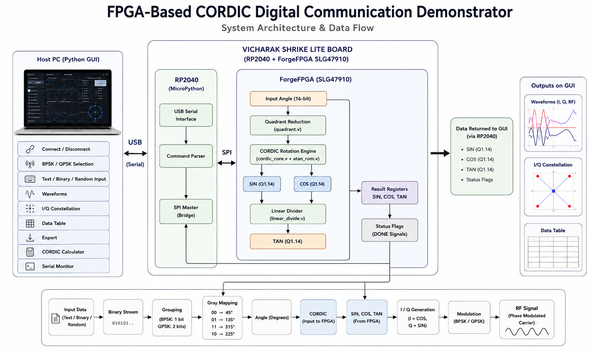

# FPGA-Based CORDIC Digital Communication Demonstrator

---

**This project performs REAL hardware computation.** Every SIN, COS, and TAN value used in this repository is computed inside the FPGA fabric using the CORDIC algorithm, expressed purely as shift-and-add operations. Python never calls `math.sin()`, `math.cos()`, or `math.tan()` to produce a result — those functions are used only, and exclusively, as a reference for validating what the FPGA computed. The Python GUI is a visualization and control layer, not a computation engine.

---

## Overview

This project presents an **FPGA-Based CORDIC Digital Communication Demonstrator** implementing **BPSK** and **QPSK** modulation on the **Vicharak Shrike Lite** development board featuring the **Renesas ForgeFPGA SLG47910**. The system computes **sine**, **cosine**, and **tangent** entirely in hardware using the **CORDIC (COordinate Rotation DIgital Computer)** algorithm, eliminating the need for hardware multipliers.

The implementation employs **16-bit signed fixed-point (Q1.14)** arithmetic with an **8-iteration CORDIC rotation engine** for sine and cosine generation, followed by a **6-iteration linear divider** for tangent computation. The FPGA performs all mathematical processing, while the on-board RP2040 acts solely as a USB-to-SPI communication bridge between the Python GUI and the FPGA.

The hardware-generated trigonometric values are used to produce **Gray-coded BPSK** and **QPSK** symbols, which are visualized in the desktop GUI through waveform plots, constellation diagrams, and real-time processing views. The project demonstrates the complete signal processing chain from input data to digital modulation while operating within the resource constraints of the **140-CLB ForgeFPGA**.

---

## Hardware Used

| Component | Role | Details |
|---|---|---|
| **Vicharak Shrike Lite** | Main hardware platform | Integrated development board containing both the **RP2040** and **Renesas ForgeFPGA SLG47910**. |
| **USB-Serial Link** | Host communication | USB CDC serial connection between the Python GUI and the Vicharak Shrike Lite. |

---

## Architecture

The following diagram illustrates the complete system architecture and data flow of the FPGA-Based CORDIC Digital Communication Demonstrator.

<p align="center">
  
</p>

The Python Host GUI communicates with the Vicharak Shrike Lite board through a USB serial connection. The on-board RP2040 acts as a communication bridge, forwarding commands to the Renesas ForgeFPGA SLG47910 over the internal SPI interface. The FPGA performs quadrant reduction, CORDIC rotation, SIN/COS computation, and Linear Divider-based TAN computation entirely in hardware. The computed results are then transferred back through the RP2040 to the GUI, where they are visualized as modulation waveforms, I/Q constellation points, and processing results for both BPSK and QPSK communication modes.

---

## Hardware Setup

No external hardware connections are required to use the demonstrator. The **Vicharak Shrike Lite** integrates both the **Renesas ForgeFPGA SLG47910** and the **RP2040** on a single development board. Communication between the desktop GUI and the FPGA is performed through the onboard RP2040 over USB Serial and SPI.

### On-board FPGA Connections

| FPGA Port | Direction | Board Signal | Description |
|-----------|-----------|--------------|-------------|
| `clk` | Input | Internal Oscillator | System clock for FPGA logic |
| `clk_en` | Output | Oscillator Enable | Enables the onboard oscillator |
| `rst_n` | Input | Reset | Active-low system reset |
| `led` | Output | User LED | Status indication |
| `spi_sck` | Input | SPI Clock | SPI clock from RP2040 |
| `spi_mosi` | Input | SPI MOSI | Command and angle data from RP2040 |
| `spi_miso` | Output | SPI MISO | SIN, COS and TAN data returned to RP2040 |
| `spi_miso_en` | Output | SPI Output Enable | Enables FPGA SPI output driver |
| `spi_ss_n` | Input | SPI Chip Select | Active-low SPI slave select |

### Communication Interface

| Interface | Function |
|-----------|----------|
| USB Serial | Host PC GUI ↔ RP2040 communication |
| SPI | RP2040 ↔ ForgeFPGA communication |
| Internal Oscillator | FPGA system clock |

> **Note:** All communication between the Host PC and the FPGA is performed through the onboard RP2040. No additional wiring or external hardware is required for normal operation.

---

## The CORDIC Algorithm

The **CORDIC (COordinate Rotation DIgital Computer)** algorithm computes trigonometric functions using only **shift**, **add**, and **subtract** operations, making it well suited for FPGA implementations that lack dedicated hardware multipliers. This project implements the **Rotation Mode CORDIC** algorithm to generate **SIN** and **COS**, followed by a **Linear CORDIC Divider** to compute **TAN**.

### Rotation Equations

For each iteration *i*, the vector is rotated according to the sign of the residual angle:

```text
if zᵢ ≥ 0:
    xᵢ₊₁ = xᵢ − (yᵢ >> i)
    yᵢ₊₁ = yᵢ + (xᵢ >> i)
    zᵢ₊₁ = zᵢ − atan(2⁻ⁱ)
else:
    xᵢ₊₁ = xᵢ + (yᵢ >> i)
    yᵢ₊₁ = yᵢ − (xᵢ >> i)
    zᵢ₊₁ = zᵢ + atan(2⁻ⁱ)
```

After **8 iterations**, the resulting vector components correspond to the hardware-generated **cosine** and **sine** values of the input angle.

### Quadrant Reduction

The CORDIC engine operates on angles within the first quadrant. Therefore, every input angle is first processed by the **Quadrant Reduction** block, which maps it into the required operating range while recording the original quadrant. After the CORDIC computation, the appropriate sign corrections are applied to produce the final SIN and COS values.

### Arctangent Lookup Table

Each CORDIC iteration requires the constant **atan(2⁻ⁱ)**. These values are precomputed and stored in a small lookup table (`atan_rom.v`), eliminating the need for runtime trigonometric calculations.

### CORDIC Gain Compensation

Successive CORDIC rotations introduce a constant scaling factor. To compensate for this gain, the initial vector is pre-scaled by the inverse CORDIC gain (**K ≈ 0.6072529**), producing correctly scaled sine and cosine outputs without requiring additional hardware.

### Fixed-Point Representation

The design uses **16-bit signed Q1.14 fixed-point arithmetic** for all external inputs and outputs. To reduce FPGA resource utilization, the internal CORDIC computations operate using a reduced **Q1.8 fixed-point format**, while the final results are converted back to **Q1.14** before transmission over SPI.

### Tangent Computation

The tangent value is computed entirely in hardware using the **Linear CORDIC Divider** (`linear_divide.v`). The divider takes the hardware-generated SIN and COS values as inputs and performs a **6-iteration** shift-add division algorithm to produce the final TAN output. No software-based trigonometric functions or hardware divider IP are used.

---

## BPSK (Binary Phase Shift Keying)

### Theory

BPSK is the simplest phase-shift-keying scheme: each bit is mapped to one of exactly two phase states, 180° apart on the unit circle.

### Equation

```
s(t) = A · cos(2π f_c t + θ)
where θ = 0°   for bit = 1
      θ = 180° for bit = 0
```

### Constellation

| Bit | Phase (θ) | I | Q |
|:---:|:---:|:---:|:---:|
| `1` | 0° | `+1` | `0` |
| `0` | 180° | `−1` | `0` |

### Advantages

- Maximum noise immunity per symbol among common PSK schemes (largest possible phase separation)
- Extremely simple demodulation — a single sign decision
- Lowest hardware complexity, making it ideal as a first demonstration on constrained hardware

### Waveform Behavior

Because the phase flips a full 180° between a `1` and a `0`, the BPSK waveform shows a sharp, visible phase discontinuity at every bit transition — this discontinuity is exactly what the CORDIC core is asked to compute a new `(cos θ, sin θ)` pair for, symbol by symbol.

---

## QPSK (Quadrature Phase Shift Keying)

### Theory

QPSK doubles the spectral efficiency of BPSK by encoding **2 bits per symbol**, mapping each 2-bit group to one of four phase states, 90° apart.

### Gray Coding

Adjacent constellation points differ by only **one bit**, minimizing the bit-error impact of a symbol being mistaken for its nearest neighbor due to noise:

| Bit Pair | Phase (θ) | I | Q |
|:---:|:---:|:---:|:---:|
| `00` | 45° | `+0.707` | `+0.707` |
| `01` | 135° | `−0.707` | `+0.707` |
| `11` | 225° | `−0.707` | `−0.707` |
| `10` | 315° | `+0.707` | `−0.707` |

### Phase Mapping Equation

```
s(t) = A · cos(2π f_c t + θ), θ ∈ {45°, 135°, 225°, 315°}
```

### Advantages

- Twice the bit rate of BPSK for the same symbol rate and bandwidth
- Still relatively simple to demodulate compared to higher-order QAM schemes
- Directly exercises all four quadrants of the CORDIC's angle range, making it the scheme that most thoroughly tests the angle-reduction logic

---

## SPI Communication Protocol

A minimal, byte-oriented command set drives the entire system. Every command is a single byte sent by the RP2040 (as SPI controller); replies are shifted back on the same transaction.

| Command | Direction | Payload | Description |
|:---:|:---:|---|---|
| `0xA1` | RP2040 to FPGA | 4 bytes, little-endian | Sends a new angle (Q1.14 fixed-point, radians × 16384) and triggers a new computation |
| `0xA2` | FPGA to RP2040 | 1 bit (in LSB of reply byte) | SIN/COS ready flag — polled until set before reading results |
| `0xA3` | FPGA to RP2040 | 1 byte | SIN result, low byte |
| `0xA4` | FPGA to RP2040 | 1 byte | SIN result, high byte |
| `0xA5` | FPGA to RP2040 | 1 bit (in LSB of reply byte) | TAN ready flag — polled after `0xA2`, since the linear divider runs after the rotation CORDIC finishes |
| `0xA6` | FPGA to RP2040 | 1 byte | COS result, low byte |
| `0xA7` | FPGA to RP2040 | 1 byte | COS result, high byte |
| `0xA8` | FPGA to RP2040 | 1 byte | TAN result, low byte |
| `0xA9` | FPGA to RP2040 | 1 byte | TAN result, high byte |

---

## Installation

### 1. Clone the Repository

```bash
git clone https://github.com/<your-username>/fpga-cordic-digital-comm-demonstrator.git
cd fpga-cordic-digital-comm-demonstrator
```

### 2. Install Python Requirements

```bash
pip install -r requirements.txt
```

This installs PyQt, Matplotlib, NumPy, and PySerial for the GUI and validation utilities.

### 3. Flash MicroPython Firmware to the RP2040

Open the firmware folder in **Thonny**, connect the Shrike Lite over USB, and flash the MicroPython firmware to the RP2040's filesystem.

### 4. Program the FPGA Bitstream

Using the ForgeFPGA toolchain (GateForge / Logic Studio), synthesize and generate the bitstream from the Verilog sources, then flash it to the SLG47910 via the RP2040's `shrike.flash()` utility.

### 5. Run the GUI

```bash
python gui/main.py
```

---

## Running the Project

The project can be used in **two different modes**.

### Option 1 — CORDIC Calculator (Thonny)

1. Connect the **Vicharak Shrike Lite** to your computer via USB.
2. Upload and run `firmware/cordic.py` using Thonny.
3. The script automatically programs the FPGA using `bitstream/FPGA_bitstream_MCU.bin`.
4. Enter the desired angle in degrees or radians.
5. View the FPGA-generated **SIN**, **COS**, and **TAN** values in the Thonny Shell alongside the corresponding software reference values.

---

### Option 2 — Digital Communication Demonstrator (Host GUI)

1. Connect the **Vicharak Shrike Lite** to your computer via USB.
2. Download and launch the latest Host GUI executable from the **Releases** section of this repository.
3. Select the appropriate COM port and establish the connection.
4. Choose the desired modulation scheme (**BPSK** or **QPSK**).
5. Select the input mode (**Binary**, **ASCII**, or **Random Data**).
6. Start the transmission.
7. Observe the FPGA-generated results through:
   - Baseband and Modulated Waveforms
   - Constellation Diagram
   - Live Symbol Statistics
   - FPGA-generated SIN, COS, TAN, and I/Q values
   - Data Table and Communication Monitor

---

## Results

The system reliably reproduces textbook SIN, COS, and TAN values for arbitrary input angles, including angles well outside a single revolution (e.g. `10009393°`, `-720°`), confirming that angle reduction, sign restoration, and both CORDIC engines behave correctly across the full range. Because the internal CORDIC datapath was deliberately narrowed to fit the SLG47910's CLB budget, results carry a modest, consistent numerical error relative to double-precision software trig — small enough to be functionally invisible in the resulting BPSK/QPSK constellations, but visible if you compare raw values directly.

BPSK constellations show two cleanly separated points at 0° and 180°; QPSK constellations show four Gray-coded points at 45°, 135°, 225°, and 315° — both populated entirely from FPGA-returned I/Q pairs, with no software-side trigonometric substitution at any point in the transmit chain.

---

## Demo video

Follow this link to the demonstration video of this project: 
https://drive.google.com/file/d/1Dd9nR5_YoyCKQmANm5gbVPkOjhAbYgId/view?usp=sharing


## Developed by

**Pranjal Upadhyay**  
<sub>Indian Institute of Information Technology, Design and Manufacturing, Kurnool</sub>
