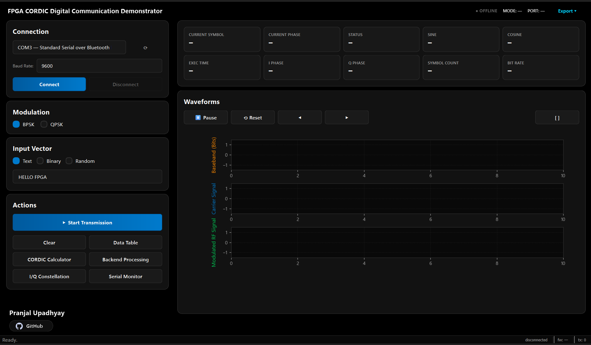
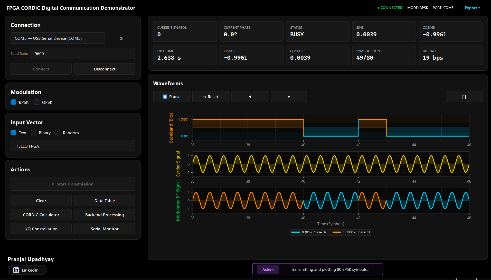
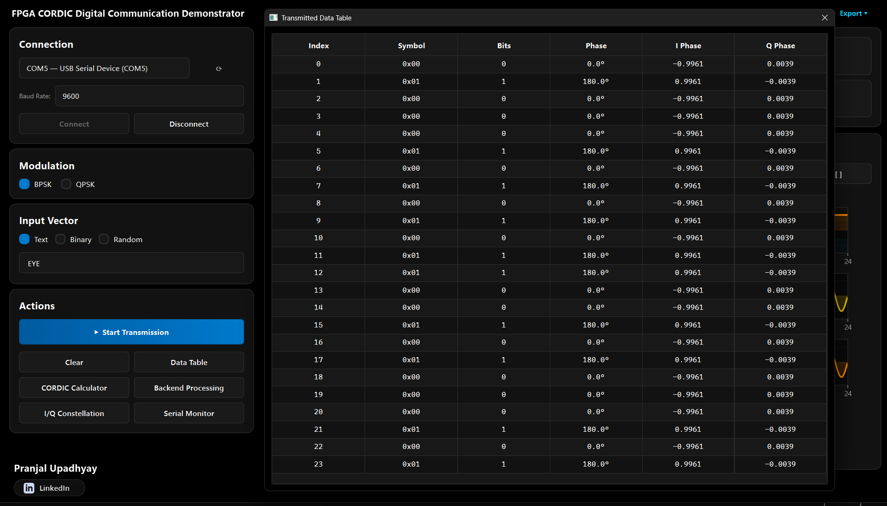
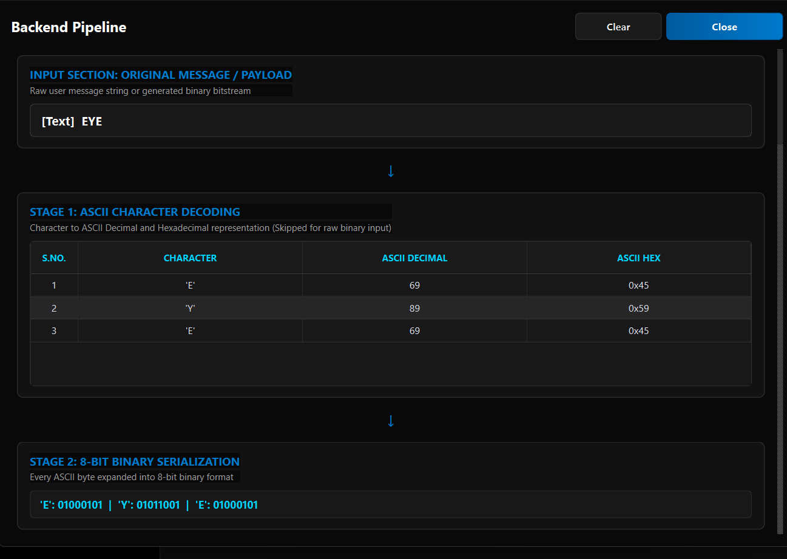
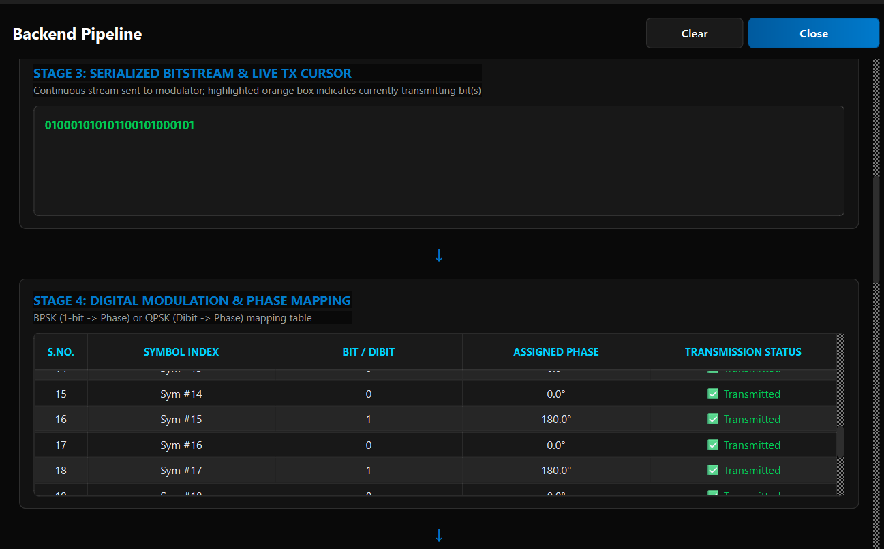
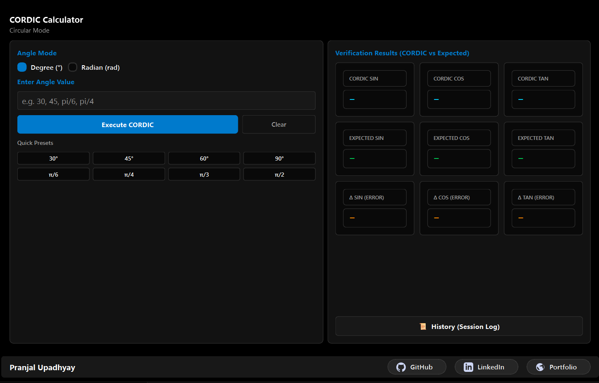

# Graphical User Interface (GUI) Guide

The Python Host GUI serves as the primary interface between the user and the FPGA-Based CORDIC Digital Communication Demonstrator.

It provides complete control over serial communication, digital modulation, waveform visualization, FPGA CORDIC verification, backend processing inspection, and transmission analysis in a single application.

---

# Main Dashboard

  

The main dashboard is divided into multiple functional sections that allow users to configure communication, transmit data, observe FPGA-generated signals, and inspect transmission statistics in real time.

---

## Connection Panel

Responsible for establishing communication with the RP2040 through USB Serial.

**Features include**

- Automatic serial port detection
- Baud rate selection
- Connect / Disconnect controls
- Connection status monitoring

Once connected, the GUI continuously exchanges packets with the RP2040, which forwards requests to the FPGA over SPI.

---

## Modulation Selection

Allows the user to select the modulation technique implemented in hardware.

**Supported modes**

- BPSK
- QPSK

The selected modulation determines how binary symbols are mapped into carrier phases inside the FPGA.

---

## Input Vector

Defines the data to be transmitted.

**Supported input modes**

- ASCII Text
- Binary Stream
- Random Bit Generation

The selected input is converted into a serial bitstream before transmission.

---

## Action Panel

Provides access to all major GUI utilities.

**Available functions include**

- Start Transmission
- Clear Session
- Transmitted Data Table
- Backend Processing Viewer
- CORDIC Calculator
- I/Q Constellation Viewer
- Serial Monitor

These tools provide both operational control and educational visualization of the complete communication pipeline.

---

## Real-Time Status Cards

The dashboard continuously displays the latest information received from the FPGA.

The status cards include

- Current Symbol
- Current Phase
- Current Status
- FPGA Sine
- FPGA Cosine
- Execution Time
- I Phase
- Q Phase
- Symbol Count
- Bit Rate

These values are refreshed in real time while transmission is active, allowing users to monitor the most recently transmitted symbol together with the corresponding trigonometric values generated by the FPGA CORDIC engine.

---

## Waveform Viewer

  

The waveform viewer visualizes the complete digital communication process in real time.

Displayed plots include

- Baseband Bit Stream
- Carrier Signal
- Modulated RF Signal

During transmission, the plots are continuously updated as new symbols are received from the FPGA.

Additional controls allow users to

- Pause plotting
- Resume plotting
- Reset graphs
- Navigate through captured samples
- Export captured waveform data

The visualization demonstrates how binary symbols are converted into phase-modulated carrier waveforms generated using the FPGA CORDIC engine.

---

# Transmitted Data Table

  

The **Transmitted Data Table** displays detailed information for every symbol transmitted by the FPGA.

Each row represents one transmitted symbol and includes

- Symbol Index
- Symbol Value
- Input Bit / Dibit
- Assigned Carrier Phase
- I Component
- Q Component

The table provides a symbol-by-symbol record of the complete transmission and is useful for

- Verifying transmitted data
- Inspecting FPGA-generated I/Q values
- Debugging communication
- Comparing hardware outputs across symbols
- Validating digital modulation mapping

This feature serves as a convenient debugging and verification tool during hardware testing.

---

# Backend Processing Viewer

  

 

  

The Backend Processing Viewer illustrates the complete processing pipeline executed before digital modulation.

Rather than acting as a simple log window, it presents every intermediate processing stage, allowing users to observe how the original payload is transformed into FPGA-ready symbols.

---

## Stage 1 — Input Processing

Displays the original user payload.

Depending on the selected input mode, the payload may consist of

- ASCII Text
- Binary Sequence
- Randomly Generated Bitstream

---

## Stage 2 — ASCII Character Decoding

When Text mode is selected, every character is converted into

- ASCII Decimal
- ASCII Hexadecimal

This stage demonstrates how human-readable text is internally represented before serialization.

---

## Stage 3 — Binary Serialization

Every ASCII byte is expanded into its corresponding 8-bit binary representation.

The serialized bitstream shown in this stage represents the exact sequence transmitted toward the FPGA.

A live transmission cursor continuously highlights the current bit being transmitted, allowing users to observe real-time transmission progress.

---

## Stage 4 — Digital Modulation Mapping

Each transmitted bit (BPSK) or dibit (QPSK) is mapped to its corresponding carrier phase.

Displayed information includes

- Symbol Index
- Input Bit / Dibit
- Assigned Phase
- Transmission Status

This stage clearly demonstrates how digital information is transformed into phase-modulated symbols before being transmitted to the FPGA.

The Backend Processing Viewer is intended primarily as an educational visualization tool, making every stage of the digital communication pipeline transparent to the user.

---

# CORDIC Calculator

  

The integrated CORDIC Calculator provides an independent interface for validating the FPGA-based CORDIC processor without transmitting communication data.

Users may compute

- Sine
- Cosine
- Tangent

using either

- Degree Mode
- Radian Mode

---

## Features

- Degree and Radian input selection
- Manual angle entry
- One-click FPGA execution
- Common angle quick presets
- Session history logging
- Hardware versus software comparison

---

## Verification Panel

For every requested angle, the calculator displays

**FPGA CORDIC Results**

- Sine
- Cosine
- Tangent

alongside

**Software Reference Results**

- Expected Sine
- Expected Cosine
- Expected Tangent

It also computes the absolute numerical error

- Δ SIN
- Δ COS
- Δ TAN

allowing direct comparison between the FPGA-generated fixed-point CORDIC outputs and floating-point software calculations.

The CORDIC Calculator serves both as a hardware verification utility and as an educational demonstration of the Circular CORDIC algorithm implemented on the FPGA.
